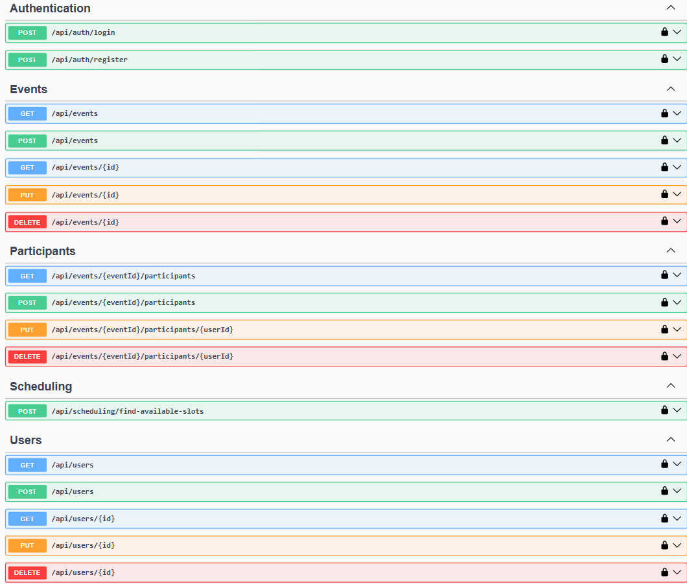

# AICalendar

AI Calendar is a clean-architecture .NET 9 solution for scheduling events, managing participants, and exposing a minimal Web API plus a Model Context Protocol (MCP) server so LLMs can interact with your calendar.

- Web API: Minimal APIs with JWT auth, Swagger, MediatR, FluentValidation, EF Core (SQL Server)
- MCP Server: Bridges LLM tools (e.g., Claude Desktop) to the Web API via MCP resources and tools
- Logging and diagnostics via Serilog

## Features

- Authentication and authorization
  - Register and login with JWT
  - Role-based policies (Admin/User)
- Users
  - Query, get by id, update; Admin-only create/delete
- Events
  - Create, update, delete, query (by date range and status), get by id
- Participants
  - Add/remove participants; update status (Pending/Accepted/Declined/Tentative)
- Scheduling
  - Find common available time slots for a group of users
- Developer experience
  - Swagger UI (OpenAPI) at /swagger
  - Database seeding with sample users, events, and participants
  - Clean architecture layers and MediatR pipeline behaviors (validation, logging)

## Solution structure

- src/
  - Domain: Core entities, value objects, enums, domain services and interfaces
  - Application: DTOs, commands/queries (MediatR), validators, behaviors
  - Infrastructure: EF Core DbContext, repositories, services (Auth/JWT/Scheduling), Serilog, DI, seeding
  - WebAPI: Minimal API endpoints (Auth, Users, Events, Participants, Scheduling), Swagger, DI wiring
  - MCPServer: MCP handler and server exposing calendar tools/resources; HTTP client to the Web API
- tests/: Unit tests per layer (Domain, Application, Infrastructure, WebAPI, MCPServer)

## Tech stack

- .NET 9, C# 12
- EF Core 9 (SQL Server LocalDB by default)
- MediatR, FluentValidation
- JWT Bearer Authentication
- Serilog (Console + File)
- Swashbuckle (Swagger/OpenAPI)
- MCP (Model Context Protocol) components for LLM integration

## Quick start

Prerequisites
- .NET 9 SDK
- SQL Server LocalDB (installed with Visual Studio) or update the connection string
- PowerShell (pwsh) for the commands below

1) Restore and build
```pwsh
# from repo root
dotnet restore
dotnet build
```

2) Configure settings (optional)
- Web API config: `src/WebAPI/appsettings.json`
  - DefaultConnection uses LocalDB: `(localdb)\\mssqllocaldb`
  - JWT settings (Issuer, Audience, Key)
- MCP Server config: `src/MCPServer/appsettings.json`
  - `ApiBaseUrl` must point to your Web API (default `http://localhost:5178`)

3) Run the Web API
```pwsh
# creates and seeds the database automatically on first run
dotnet run --project src/WebAPI
```
- Swagger UI: http://localhost:5178/swagger (root `/` redirects to `/swagger`)
- CORS is open in development (AllowAnyOrigin/Method/Header)

4) Sign in with seeded users
The database seeder creates an admin and sample users:
- Admin: admin@aicalendar.com / Admin123!
- John Smith: john.smith@example.com / Password123!
- Jane Doe: jane.doe@example.com / Password123!
- Bob Johnson: bob.johnson@example.com / Password123!

Use the Swagger “Authorize” button. Enter: `Bearer <your_token>` after calling POST `/api/auth/login`.

### Run with Docker Compose (optional)

Bring up SQL Server and the Web API:
```pwsh
docker compose up --build
```
- Web API: http://localhost:5178/swagger
- SQL Server runs in a container (sa/Your_strong_password123). Data is ephemeral by default.

Stop and remove containers:
```pwsh
docker compose down
```

## Optional steps

1) Run with HTTPS locally
```pwsh
dotnet dev-certs https --trust
dotnet run --project src/WebAPI --launch-profile https
```

2) Override config with environment variables (useful for CI or local secrets)
```pwsh
$env:ASPNETCORE_ENVIRONMENT="Development"
$env:ConnectionStrings__DefaultConnection="Server=.;Database=AICalendarDb;Trusted_Connection=True;TrustServerCertificate=True"
$env:JwtSettings__Key="ChangeMe_AtLeast32Chars_Long_Long"
dotnet run --project src/WebAPI
```

3) Use EF Core migrations (instead of EnsureCreated)
- See the "Database and migrations" section below for commands.
- To fully switch, replace `EnsureCreatedAsync()` with `Database.Migrate()` in `InitializeDatabaseAsync`.

4) Use Dockerized SQL Server
```pwsh
docker run -e "ACCEPT_EULA=Y" -e "MSSQL_SA_PASSWORD=Your_strong_password123" -p 1433:1433 -d mcr.microsoft.com/mssql/server:2022-latest
```
Example connection string:
```
Server=localhost,1433;Database=AICalendarDb;User Id=sa;Password=Your_strong_password123;TrustServerCertificate=True
```

5) Fix Claude Desktop MCP config path
- Update `src/MCPServer/claude_config.json` → `args` to point at your local repo path (e.g., `c:\Users\gogol\Desktop\AICalendar\src\MCPServer`).

6) Run a specific test project
```pwsh
dotnet test tests/Domain.Tests
```

## API overview



Authentication (no auth required)
- POST `/api/auth/register` — register and receive JWT
- POST `/api/auth/login` — login and receive JWT

Users (RequireAuthorization; some Admin-only)
- GET `/api/users` — list with optional `name` and `email` filters
- GET `/api/users/{id}` — get by id
- POST `/api/users` — create (Admin policy)
- PUT `/api/users/{id}` — update
- DELETE `/api/users/{id}` — delete (Admin policy)

Events (RequireAuthorization)
- GET `/api/events?startDate=...&endDate=...&status=0|1|2` — list by optional filters
- GET `/api/events/{id}` — get by id
- POST `/api/events?organizerId={guid}` — create
- PUT `/api/events/{id}` — update
- DELETE `/api/events/{id}` — delete

Participants (nested under events; RequireAuthorization)
- GET `/api/events/{eventId}/participants` — list participants
- POST `/api/events/{eventId}/participants` — add participant
- PUT `/api/events/{eventId}/participants/{userId}` — update participant status
- DELETE `/api/events/{eventId}/participants/{userId}` — remove participant

Scheduling (RequireAuthorization)
- POST `/api/scheduling/find-available-slots` — compute available time slots for users
  - Body: `{ userIds: Guid[], start: DateTime, end: DateTime, durationMinutes: number, maxResults?: number }`

Notes
- Status enums are defined in `src/Domain/Enums` (EventStatus, ParticipantStatus).
- DTOs live in `src/Application/DTOs`.

## Running the MCP Server

The MCP server lets LLM tools interact with AICalendar via standardized resources and tools.

1) Ensure Web API is running and reachable at the `ApiBaseUrl` configured in `src/MCPServer/appsettings.json`.
2) Run the MCP server:
```pwsh
dotnet run --project src/MCPServer
```
3) Optional: Integrate with Claude Desktop or another MCP client
- See `src/MCPServer/README.md` for resources, tools, and example messages
- The provided `claude_config.json` includes a command to run the server; update the project path to match your local repo

MCP resources and tools (high level)
- Resources: `calendar://events`, `calendar://events/{id}`, `calendar://events/{id}/participants`
- Tools: `create_event`, `update_event`, `delete_event`, `add_participant`, `update_participant_status`, `remove_participant`
- Prompts: `schedule_meeting`, `find_best_time`

### MCP Server in Docker (advanced/optional)

The MCP server communicates over stdin/stdout with its client. Running it in Docker only makes sense if your MCP client can attach to the container’s stdio (or you create a bridge). If that fits your setup, you can build it:
```pwsh
docker build -t aicalendar-mcp ./src/MCPServer
docker run --rm -e ASPNETCORE_ENVIRONMENT=Development -e ApiBaseUrl=http://host.docker.internal:5178 aicalendar-mcp
```
Otherwise, prefer running it directly on your host:
```pwsh
dotnet run --project src/MCPServer
```

## Database and migrations

- On startup, the API calls `EnsureCreated()` and seeds data if the DB is empty.
- Migrations are present under `src/Infrastructure/Migrations`, but not applied automatically.
- If you prefer migrations, you can use:
```pwsh
# optional: install EF tools if needed
# dotnet tool install --global dotnet-ef

# add a migration
# dotnet ef migrations add <Name> --project src/Infrastructure --startup-project src/WebAPI

# apply migrations
# dotnet ef database update --project src/Infrastructure --startup-project src/WebAPI
```

To switch runtime behavior from EnsureCreated to migrations, replace EnsureCreated with `Database.Migrate()` in `InitializeDatabaseAsync` and manage the migration lifecycle.

## Testing

Run all tests:
```pwsh
dotnet test
```
- Domain tests include `SchedulingServiceTests`.
- MCPServer includes helper scripts like `test_mcp.ps1` and `comprehensive_test.py` for protocol-level checks.

## Configuration reference

Web API (`src/WebAPI/appsettings.json`)
- ConnectionStrings: `DefaultConnection` (SQL Server)
- JwtSettings: `Key`, `Issuer`, `Audience`, `DurationInMinutes`
- Serilog sinks (Console/File)

MCP Server (`src/MCPServer/appsettings.json`)
- `ApiBaseUrl`: Base URL of the running Web API (default `http://localhost:5178`)
- `MCPServer`: name, version, description for identification

## Troubleshooting

- Web API not reachable from MCP Server
  - Verify Web API is running and `ApiBaseUrl` matches (http vs https, port 5178/7025 per launch settings)
- DB issues on first run
  - LocalDB required by default connection string; update the connection string to your SQL instance if needed
- JWT 401 in Swagger
  - Login first (`/api/auth/login`), click Authorize, and paste `Bearer <token>`
- Admin-only endpoints forbidden
  - Ensure you’re using the admin account or a user with the `Admin` role

## Contributing

- Open an issue or PR with a clear description of the change
- Keep layers separated (Domain, Application, Infrastructure, WebAPI)
- Add unit tests for business logic and validators when changing behavior

## License

Add your license here (e.g., MIT) if you plan to open source.
